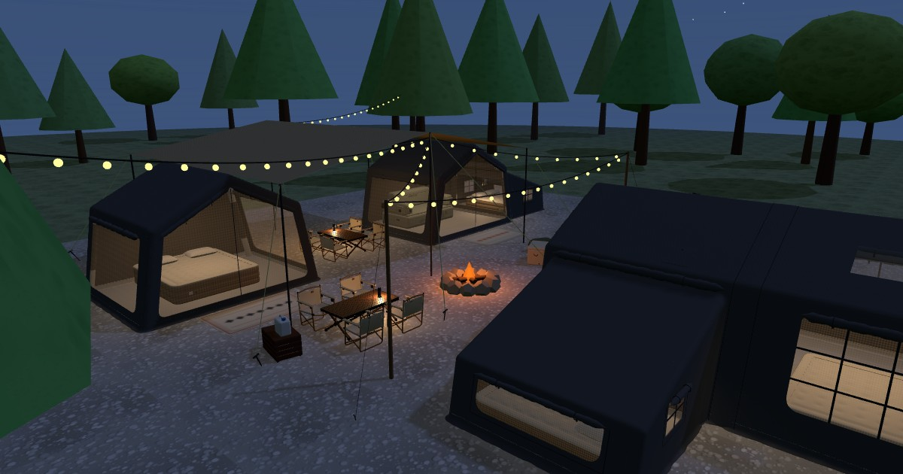

# Spark Air Tent Camping 3D Tour

An interactive 3D campsite preview of inflatable air tents (Block 10, Block 09, Block 05), built with
[three.js](https://threejs.org/). It runs entirely in the browser and has no build step.

**Live demo:** https://iverson-l.github.io/air-tent-campsite-3d/

[](https://iverson-l.github.io/air-tent-campsite-3d/)

## Features
- The full campsite (`index.html`):
  - 2× Block 10 under a 7 × 6 m flysheet, with Block 05 docked on one of them
  - a Block 10 + 09 + 05 unit and a free-standing Block 05 facing the campfire
  - egg-roll tables, folding chairs, lanterns, cooler, kitchen crate, entrance rugs
  - festoon lights on poles round the campfire, trees, and a koi pond with lily pads and reeds — wade in, swim, and hold C to dive in first-person mode, or walk up to the stool on the bank and press E to go fishing
- Detailed tent models, each with:
  - leaning walls, rounded edges and see-through mesh windows
  - roll-up flaps, an inflatable air frame with fabric sleeves and a camping lantern
  - a PVC bathtub floor, a snow skirt and an air bed or sofa
- Adjustable gap between the tents, with flysheet coverage readout
- Day / night mode (lanterns, string lights, campfire)
- Camp life: 3D grass and wildflowers, hammock, clothesline, SUV, kettle over the fire, ducks, birds, a deer, fireflies at night
- Simulated campers wandering the site (fire, picnic table, tents, pond, hammock); they shelter under the flysheet when it rains (off by default, key `7`)
- Copy a link to your exact view, or save a photo
- Rain (overcast sky, pond ripples, dry under the tents) and procedural ambient sound (birds, crickets, campfire, rain, and water swishes when you swim)
- Shortcuts: `E` fishing · `1` flysheet · `2` labels · `3` lights on/off · `4` night mode · `5` rain · `6` sound · `7` campers · `Tab` debug
- WASD flies the orbit view; first-person walk mode: WASD + mouse look, or on-screen joysticks for touch / remote desktop
- Dimension labels and a debug compass

## Pages
| Page | What |
|---|---|
| `index.html` | Full campsite |
| `block10_mock.html` | Block 10 (360 × 280 cm gable tent) |
| `block09_mock.html` | Block 09 (360 × 250 cm, back door, TPU roof window) |
| `block05.html` | Block 05 (single-slope extension) |
| `sofa_mock.html` | Inflatable sofa |
| `block10_05.html` | Block 10 + Block 05 docked |
| `block10_09_05.html` | Block 10 + 09 + 05 with an open passage |

## Run locally
Open `index.html` in a browser (three.js loads from a CDN, so you need an internet connection), or serve the folder:

```sh
python3 -m http.server 8000   # then open http://localhost:8000/
```

## Editing the models
Each tent lives in its own single-model page. The combination pages and the tent section of `index.html` are
**generated** from those pages. After editing a model, run:

```sh
python3 build_combos.py
```

See `CLAUDE.md` for the architecture notes.
